WearCPS: Safety vs. Security Analysis
================

Introduction
------------

Below is the initial analyis/breakdown of the test data collected through our website **WearCPS.me**.

Average Ages
------------

Average ages of participants:

    ##    Min. 1st Qu.  Median    Mean 3rd Qu.    Max. 
    ##   22.00   27.00   32.00   33.43   38.00   55.00

    ## `stat_bindot()` using `bins = 30`. Pick better value with `binwidth`.

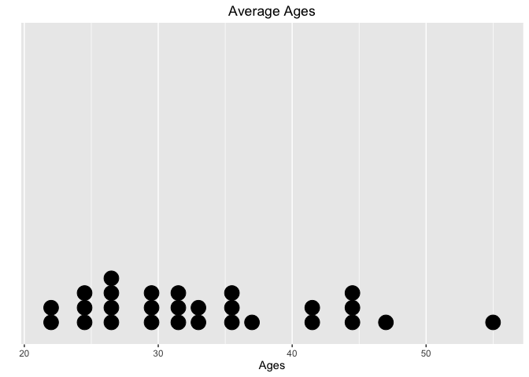

    ##     Education.Level NotificationCorrect   FinalScore    
    ##  Bachelors  :33     Min.   :0.000       Min.   :-800.0  
    ##  High School:18     1st Qu.:1.000       1st Qu.: 400.0  
    ##  Masters    : 6     Median :2.000       Median : 700.0  
    ##  Other      : 2     Mean   :1.934       Mean   : 680.3  
    ##  PhD        : 2     3rd Qu.:3.000       3rd Qu.: 900.0  
    ##                     Max.   :3.000       Max.   :3700.0

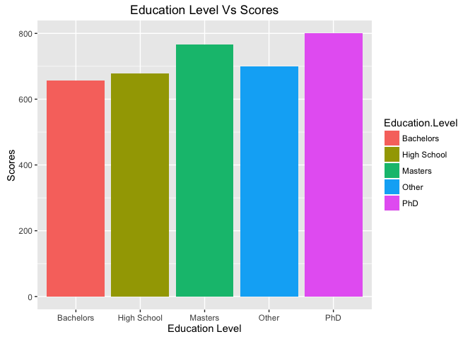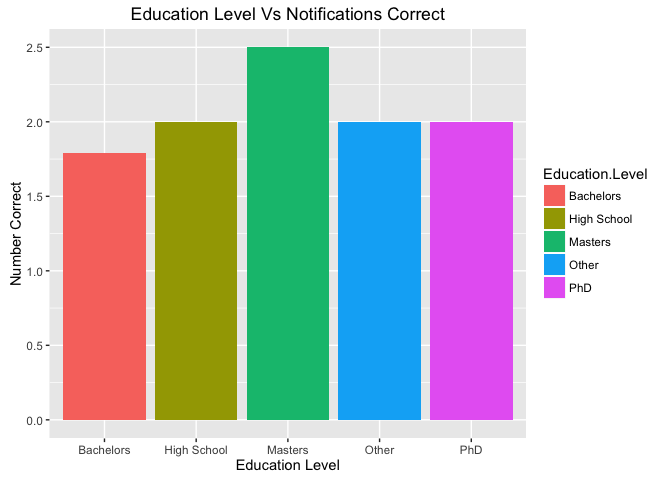

Avg. Score
----------

Basic plot of Avg. Score:

    ##      sex       finalScore    
    ##  Female:18   Min.   :-800.0  
    ##  Male  :43   1st Qu.: 400.0  
    ##              Median : 700.0  
    ##              Mean   : 680.3  
    ##              3rd Qu.: 900.0  
    ##              Max.   :3700.0

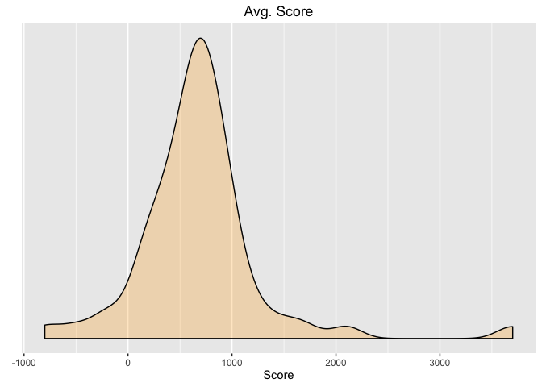

Avg. Response Time
------------------

Basic plot of Avg. Response Times:

    ##       avg            secAvg          safAvg     
    ##  Min.   : 1600   Min.   : 1516   Min.   : 1325  
    ##  1st Qu.: 2847   1st Qu.: 2634   1st Qu.: 2505  
    ##  Median : 3656   Median : 3470   Median : 3824  
    ##  Mean   : 4194   Mean   : 4058   Mean   : 4166  
    ##  3rd Qu.: 4858   3rd Qu.: 4514   3rd Qu.: 5150  
    ##  Max.   :14902   Max.   :19159   Max.   :10936

    ## No id variables; using all as measure variables

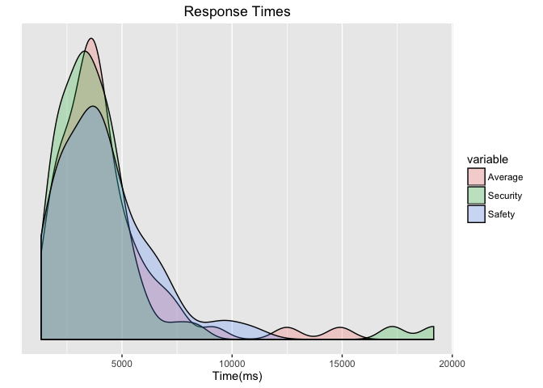

Notification Correctness
------------------------

Basic plot of Notification Correctness:

    ##    avgCorrect     secAvgCorrect    safAvgCorrect   
    ##  Min.   :0.0000   Min.   :0.0000   Min.   :0.0000  
    ##  1st Qu.:0.1667   1st Qu.:0.0000   1st Qu.:0.3333  
    ##  Median :0.3333   Median :0.0000   Median :0.3333  
    ##  Mean   :0.3260   Mean   :0.1257   Mean   :0.5273  
    ##  3rd Qu.:0.5000   3rd Qu.:0.3333   3rd Qu.:1.0000  
    ##  Max.   :0.5000   Max.   :0.6667   Max.   :1.0000

    ## No id variables; using all as measure variables

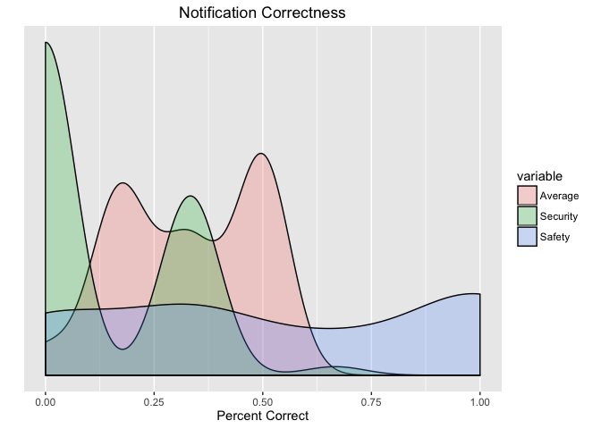

Recall Correctness
------------------

Basic plot of Recall Correctness:

    ##    avgPercent       secPercent       safPercent    
    ##  Min.   :0.0000   Min.   :0.0000   Min.   :0.0000  
    ##  1st Qu.:0.5000   1st Qu.:0.5000   1st Qu.:0.5000  
    ##  Median :0.8333   Median :1.0000   Median :0.7500  
    ##  Mean   :0.7186   Mean   :0.7049   Mean   :0.7254  
    ##  3rd Qu.:0.8333   3rd Qu.:1.0000   3rd Qu.:1.0000  
    ##  Max.   :1.0000   Max.   :1.0000   Max.   :1.0000

    ## No id variables; using all as measure variables

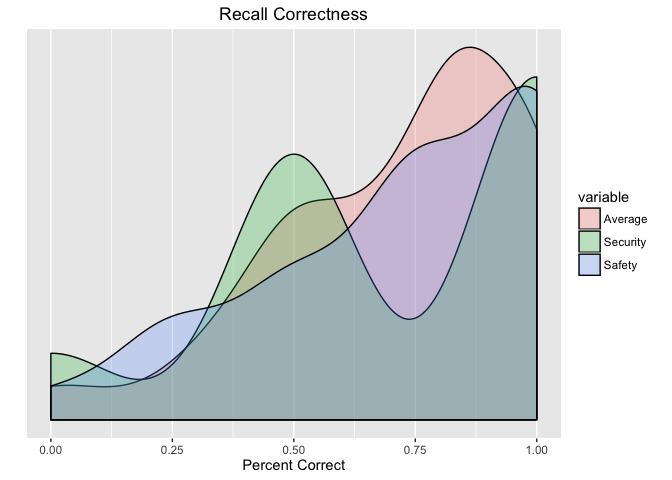

    ## 
    ## Attaching package: 'dplyr'

    ## The following objects are masked from 'package:stats':
    ## 
    ##     filter, lag

    ## The following objects are masked from 'package:base':
    ## 
    ##     intersect, setdiff, setequal, union

    ##        Type      ResponseTime  
    ##  Safety  :178   Min.   : 1091  
    ##  Security:183   1st Qu.: 2142  
    ##                 Median : 3418  
    ##                 Mean   : 4101  
    ##                 3rd Qu.: 4887  
    ##                 Max.   :53430

    ## Warning in boot.ci(boot(c(1823L, 1182L, 3432L, 5581L, 2204L, 3457L,
    ## 5295L, : bootstrap variances needed for studentized intervals

    ## Warning in boot.ci(boot(c(1823L, 1182L, 3432L, 5581L, 2204L, 3457L,
    ## 5295L, : bootstrap variances needed for studentized intervals

    ## Warning in boot.ci(boot(c(1823L, 1182L, 3432L, 5581L, 2204L, 3457L,
    ## 5295L, : bootstrap variances needed for studentized intervals

    ## Warning in boot.ci(boot(c(1823L, 1182L, 3432L, 5581L, 2204L, 3457L,
    ## 5295L, : bootstrap variances needed for studentized intervals

    ## Warning in boot.ci(boot(c(1823L, 1182L, 3432L, 5581L, 2204L, 3457L,
    ## 5295L, : bootstrap variances needed for studentized intervals

    ## Warning in boot.ci(boot(c(1823L, 1182L, 3432L, 5581L, 2204L, 3457L,
    ## 5295L, : bootstrap variances needed for studentized intervals

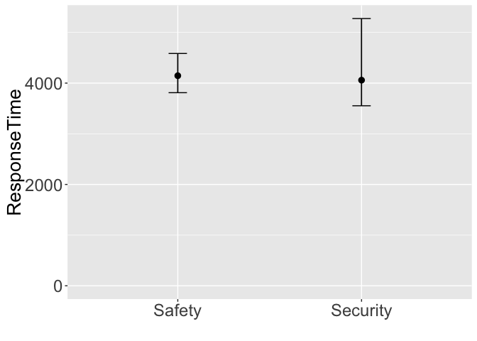

Confidence Interval Correctness
-------------------------------

Basic plot of Notification Correctness:

    ##        Type     ResponseAnswer  
    ##  Safety  :178   Min.   :0.0000  
    ##  Security:183   1st Qu.:0.0000  
    ##                 Median :0.0000  
    ##                 Mean   :0.3269  
    ##                 3rd Qu.:1.0000  
    ##                 Max.   :1.0000

    ## Warning in boot.ci(boot(c(0L, 1L, 0L, 0L, 1L, 0L, 0L, 0L, 0L, 0L, 1L, 0L, :
    ## bootstrap variances needed for studentized intervals

    ## Warning in boot.ci(boot(c(0L, 1L, 0L, 0L, 1L, 0L, 0L, 0L, 0L, 0L, 1L, 0L, :
    ## bootstrap variances needed for studentized intervals

    ## Warning in boot.ci(boot(c(0L, 1L, 0L, 0L, 1L, 0L, 0L, 0L, 0L, 0L, 1L, 0L, :
    ## bootstrap variances needed for studentized intervals

    ## Warning in boot.ci(boot(c(0L, 1L, 0L, 0L, 1L, 0L, 0L, 0L, 0L, 0L, 1L, 0L, :
    ## bootstrap variances needed for studentized intervals

    ## Warning in boot.ci(boot(c(0L, 1L, 0L, 0L, 1L, 0L, 0L, 0L, 0L, 0L, 1L, 0L, :
    ## bootstrap variances needed for studentized intervals

    ## Warning in boot.ci(boot(c(0L, 1L, 0L, 0L, 1L, 0L, 0L, 0L, 0L, 0L, 1L, 0L, :
    ## bootstrap variances needed for studentized intervals

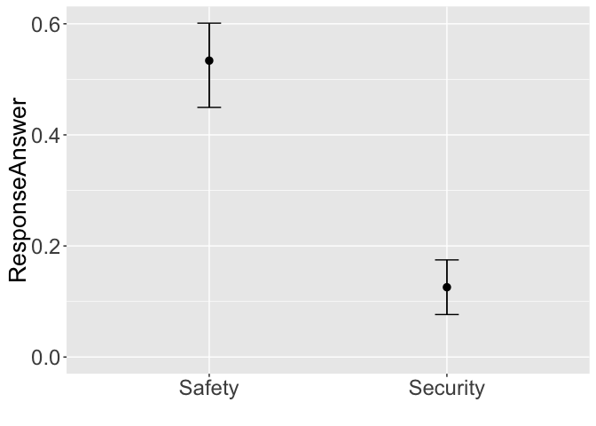 \#\#\# Primary Task Score Over Time

Basic plot of Recall Correctness:

``` r
summary(filterPrimaryTaskScoreTimes)
```

    ##         ParticipantID PrimaryTaskEntryTime     Score        
    ##  A4J4GGMKJ68L0 : 44   Min.   : 37.52       Min.   :-1000.0  
    ##  A1A3TGZ7DKJWRW: 24   1st Qu.:140.06       1st Qu.:  100.0  
    ##  A3UAO2LYUPO7L6: 22   Median :190.62       Median :  300.0  
    ##  A3OV174HQJIJK8: 20   Mean   :205.30       Mean   :  429.5  
    ##  A1C59M3HPCO503: 19   3rd Qu.:250.89       3rd Qu.:  600.0  
    ##  A1FOTRH3UJMKTS: 18   Max.   :519.50       Max.   : 3700.0  
    ##  (Other)       :608

``` r
ggplot(filterPrimaryTaskScoreTimes, aes(x=filterPrimaryTaskScoreTimes$PrimaryTaskEntryTime, y=filterPrimaryTaskScoreTimes$Score)) +  geom_point() + ggtitle("Score Vs. Time") + labs(x="Time", y ="Score")
```

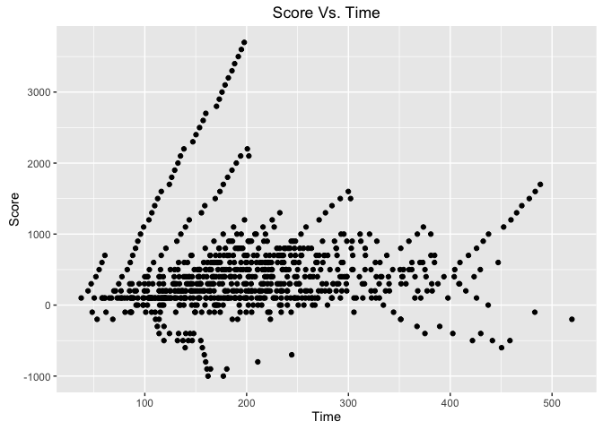

### Notification Grade Level Versus Response Correctness

Basic plot of Recall Correctness:

``` r
summary(filterNotificationGradeLevels)
```

    ##    GradeLevel        Correct      
    ##  Min.   : 6.820   Min.   :0.0000  
    ##  1st Qu.: 7.200   1st Qu.:0.0000  
    ##  Median : 9.760   Median :0.0000  
    ##  Mean   : 9.499   Mean   :0.3269  
    ##  3rd Qu.: 9.770   3rd Qu.:1.0000  
    ##  Max.   :14.040   Max.   :1.0000

``` r
#grade_level_data <- aggregate(Correct~GradeLevel, data=filterNotificationGradeLevels, #FUN=function(filterNotificationGradeLevels) c(mean=mean(filterNotificationGradeLevels), #count=length(filterNotificationGradeLevels)))

ggplot(filterNotificationGradeLevels, aes(x=GradeLevel, y=Correct)) +  stat_summary(fun.y="mean", geom ="bar") + ggtitle("Grade Levels Vs Correctness") + labs(x="Grade Level", y ="Correctness")
```

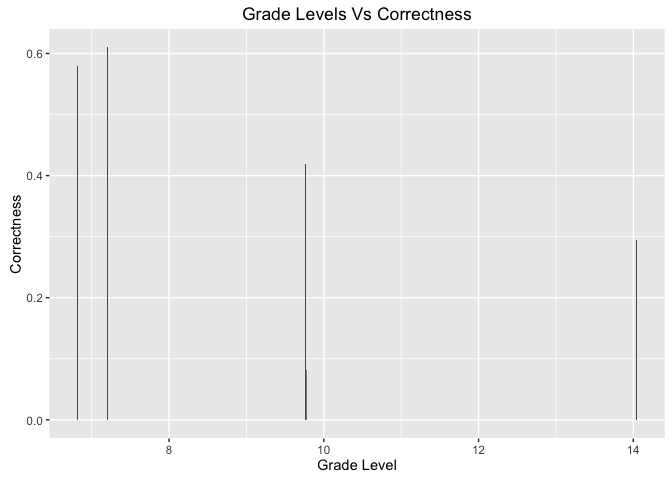

    ## d=0.02~[-0.19,0.29]

### Power Analysis

    ## [1] 79492.61

    ## [1] 100.5687

**Note** that the `echo = FALSE` parameter can be added to the code chunk to prevent printing of the R code that generates the plot.
