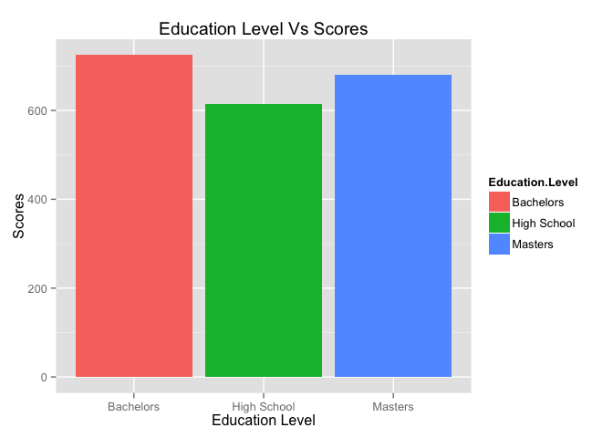
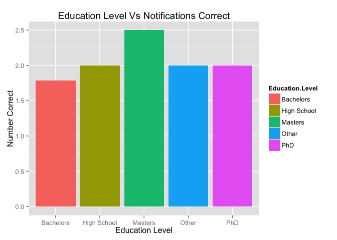
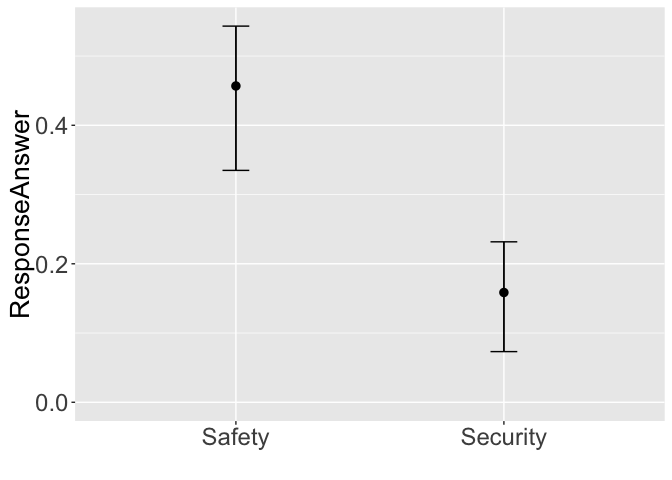
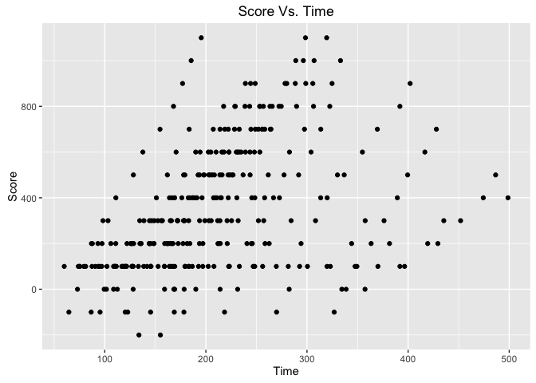
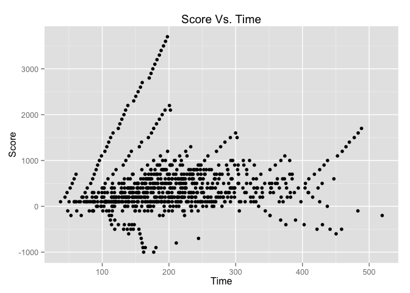

WearCPS: Safety vs. Security Analysis
================

Introduction
------------

Below is the initial analyis/breakdown of the test data collected through our website **WearCPS.me**.

Average Ages
------------

Average ages of participants:

    ##    Min. 1st Qu.  Median    Mean 3rd Qu.    Max. 
    ##   22.00   27.00   32.00   33.43   38.00   55.00

    ## `stat_bindot()` using `bins = 30`. Pick better value with `binwidth`.


    ##  EducationLevel     NotificationCorrect   FinalScore    
    ##  Length:28          Min.   :0.000       Min.   : 100.0  
    ##  Class :character   1st Qu.:1.000       1st Qu.: 575.0  
    ##  Mode  :character   Median :2.000       Median : 700.0  
    ##                     Mean   :1.786       Mean   : 689.3  
    ##                     3rd Qu.:2.250       3rd Qu.: 900.0  
    ##                     Max.   :4.000       Max.   :1100.0



Avg. Score
----------

Basic plot of Avg. Score:

    ##      sex       finalScore    
    ##  Female:11   Min.   : 100.0  
    ##  Male  :17   1st Qu.: 575.0  
    ##              Median : 700.0  
    ##              Mean   : 689.3  
    ##              3rd Qu.: 900.0  
    ##              Max.   :1100.0


Avg. Response Time
------------------

Basic plot of Avg. Response Times:

    ##       avg           secAvg         safAvg     
    ##  Min.   :1446   Min.   :1521   Min.   : 1371  
    ##  1st Qu.:2865   1st Qu.:2576   1st Qu.: 2632  
    ##  Median :3678   Median :3391   Median : 3951  
    ##  Mean   :4105   Mean   :3815   Mean   : 4399  
    ##  3rd Qu.:4881   3rd Qu.:4326   3rd Qu.: 5569  
    ##  Max.   :7426   Max.   :8151   Max.   :10017  
    ##  NA's   :1      NA's   :1      NA's   :1

    ## No id variables; using all as measure variables

    ## Warning: Removed 3 rows containing non-finite values (stat_density).


Notification Correctness
------------------------

Basic plot of Notification Correctness:

    ##    avgCorrect     secAvgCorrect    safAvgCorrect   
    ##  Min.   :0.0000   Min.   :0.0000   Min.   :0.0000  
    ##  1st Qu.:0.1667   1st Qu.:0.0000   1st Qu.:0.0000  
    ##  Median :0.3333   Median :0.0000   Median :0.6667  
    ##  Mean   :0.3051   Mean   :0.1574   Mean   :0.4568  
    ##  3rd Qu.:0.4167   3rd Qu.:0.3333   3rd Qu.:0.6667  
    ##  Max.   :0.5714   Max.   :0.6667   Max.   :1.0000  
    ##  NA's   :1        NA's   :1        NA's   :1

    ## No id variables; using all as measure variables

    ## Warning: Removed 3 rows containing non-finite values (stat_density).


Recall Correctness
------------------

Basic plot of Recall Correctness:

    ##    avgPercent       secPercent       safPercent    
    ##  Min.   :0.0000   Min.   :0.0000   Min.   :0.0000  
    ##  1st Qu.:0.6250   1st Qu.:0.5000   1st Qu.:0.5000  
    ##  Median :0.7500   Median :1.0000   Median :0.7500  
    ##  Mean   :0.7143   Mean   :0.7857   Mean   :0.6786  
    ##  3rd Qu.:0.8750   3rd Qu.:1.0000   3rd Qu.:1.0000  
    ##  Max.   :1.0000   Max.   :1.0000   Max.   :1.0000

    ## No id variables; using all as measure variables


    ## 
    ## Attaching package: 'dplyr'

    ## The following objects are masked from 'package:stats':
    ## 
    ##     filter, lag

    ## The following objects are masked from 'package:base':
    ## 
    ##     intersect, setdiff, setequal, union

    ##        Type     ResponseTime  
    ##  Safety  :81   Min.   : 1034  
    ##  Security:82   1st Qu.: 2342  
    ##                Median : 3484  
    ##                Mean   : 4097  
    ##                3rd Qu.: 5312  
    ##                Max.   :14956

    ## Warning in boot.ci(boot(c(2603L, 2538L, 3675L, 4087L, 4040L, 8364L,
    ## 5286L, : bootstrap variances needed for studentized intervals

    ## Warning in boot.ci(boot(c(2603L, 2538L, 3675L, 4087L, 4040L, 8364L,
    ## 5286L, : bootstrap variances needed for studentized intervals

    ## Warning in boot.ci(boot(c(2603L, 2538L, 3675L, 4087L, 4040L, 8364L,
    ## 5286L, : bootstrap variances needed for studentized intervals

    ## Warning in boot.ci(boot(c(2603L, 2538L, 3675L, 4087L, 4040L, 8364L,
    ## 5286L, : bootstrap variances needed for studentized intervals

    ## Warning in boot.ci(boot(c(2603L, 2538L, 3675L, 4087L, 4040L, 8364L,
    ## 5286L, : bootstrap variances needed for studentized intervals

    ## Warning in boot.ci(boot(c(2603L, 2538L, 3675L, 4087L, 4040L, 8364L,
    ## 5286L, : bootstrap variances needed for studentized intervals


Confidence Interval Correctness
-------------------------------

Basic plot of Notification Correctness:

    ##        Type    ResponseAnswer  
    ##  Safety  :81   Min.   :0.0000  
    ##  Security:82   1st Qu.:0.0000  
    ##                Median :0.0000  
    ##                Mean   :0.3067  
    ##                3rd Qu.:1.0000  
    ##                Max.   :1.0000

    ## Warning in boot.ci(boot(c(0L, 0L, 0L, 0L, 0L, 0L, 0L, 1L, 0L, 0L, 0L, 1L, :
    ## bootstrap variances needed for studentized intervals

    ## Warning in boot.ci(boot(c(0L, 0L, 0L, 0L, 0L, 0L, 0L, 1L, 0L, 0L, 0L, 1L, :
    ## bootstrap variances needed for studentized intervals

    ## Warning in boot.ci(boot(c(0L, 0L, 0L, 0L, 0L, 0L, 0L, 1L, 0L, 0L, 0L, 1L, :
    ## bootstrap variances needed for studentized intervals

    ## Warning in boot.ci(boot(c(0L, 0L, 0L, 0L, 0L, 0L, 0L, 1L, 0L, 0L, 0L, 1L, :
    ## bootstrap variances needed for studentized intervals

    ## Warning in boot.ci(boot(c(0L, 0L, 0L, 0L, 0L, 0L, 0L, 1L, 0L, 0L, 0L, 1L, :
    ## bootstrap variances needed for studentized intervals

    ## Warning in boot.ci(boot(c(0L, 0L, 0L, 0L, 0L, 0L, 0L, 1L, 0L, 0L, 0L, 1L, :
    ## bootstrap variances needed for studentized intervals

 \#\#\# Primary Task Score Over Time

Basic plot of Recall Correctness:

``` r
summary(filterPrimaryTaskScoreTimes)
```

    ##  ParticipantID      PrimaryTaskEntryTime     Score       
    ##  Length:317         Min.   : 59.93       Min.   :-200.0  
    ##  Class :character   1st Qu.:152.79       1st Qu.: 100.0  
    ##  Mode  :character   Median :203.96       Median : 300.0  
    ##                     Mean   :213.03       Mean   : 349.2  
    ##                     3rd Qu.:256.90       3rd Qu.: 500.0  
    ##                     Max.   :498.78       Max.   :1100.0

``` r
ggplot(filterPrimaryTaskScoreTimes, aes(x=filterPrimaryTaskScoreTimes$PrimaryTaskEntryTime, y=filterPrimaryTaskScoreTimes$Score)) +  geom_point() + ggtitle("Score Vs. Time") + labs(x="Time", y ="Score")
```



### Notification Grade Level Versus Response Correctness

Basic plot of Recall Correctness:

``` r
summary(filterNotificationGradeLevels)
```

    ##    GradeLevel        Correct      
    ##  Min.   : 6.820   Min.   :0.0000  
    ##  1st Qu.: 7.200   1st Qu.:0.0000  
    ##  Median : 9.150   Median :0.0000  
    ##  Mean   : 9.455   Mean   :0.3067  
    ##  3rd Qu.: 9.770   3rd Qu.:1.0000  
    ##  Max.   :14.040   Max.   :1.0000

``` r
#grade_level_data <- aggregate(Correct~GradeLevel, data=filterNotificationGradeLevels, #FUN=function(filterNotificationGradeLevels) c(mean=mean(filterNotificationGradeLevels), #count=length(filterNotificationGradeLevels)))

ggplot(filterNotificationGradeLevels, aes(x=GradeLevel, y=Correct)) +  stat_summary_bin(fun.y="mean", geom ="bar") + ggtitle("Grade Levels Vs Correctness") + labs(x="Grade Level", y ="Correctness")
```



    ## d=0.25~[-0.07,0.54]

### Power Analysis

    ## [1] 602.6842

    ## [1] 37.07659

**Note** that the `echo = FALSE` parameter can be added to the code chunk to prevent printing of the R code that generates the plot.
