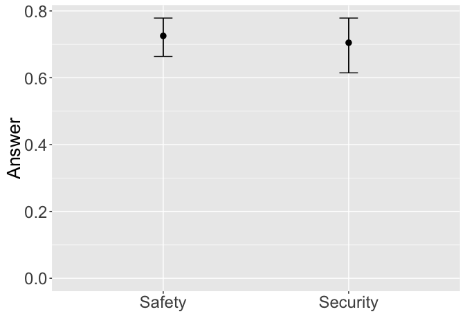

WearCPS: Safety vs. Security Analysis
================

Introduction
------------

Below is the initial analyis/breakdown of the test data collected through our online pilot, **WearCPS.me**, through Amazon's Mechanical Turk

Average Ages
------------

Average ages of participants:

    ##    Min. 1st Qu.  Median    Mean 3rd Qu.    Max. 
    ##   13.00   26.00   30.00   31.79   34.00   55.00

Score/Performance vs. Education Breakdown
-----------------------------------------

    ##      EducationLevel NotificationCorrect   FinalScore    
    ##  Bachelors  :33     Min.   :0.000       Min.   :-800.0  
    ##  High School:18     1st Qu.:1.000       1st Qu.: 400.0  
    ##  Masters    : 6     Median :2.000       Median : 700.0  
    ##  Other      : 2     Mean   :1.934       Mean   : 680.3  
    ##  PhD        : 2     3rd Qu.:3.000       3rd Qu.: 900.0  
    ##                     Max.   :3.000       Max.   :3700.0

Avg. Score
----------

PDF of Avg. Score:

    ##      sex       finalScore    
    ##  Female:18   Min.   :-800.0  
    ##  Male  :43   1st Qu.: 400.0  
    ##              Median : 700.0  
    ##              Mean   : 680.3  
    ##              3rd Qu.: 900.0  
    ##              Max.   :3700.0

Avg. Response Time
------------------

PDF of Avg. Response Times:

    ##       avg            secAvg          safAvg     
    ##  Min.   : 1600   Min.   : 1516   Min.   : 1325  
    ##  1st Qu.: 2847   1st Qu.: 2634   1st Qu.: 2505  
    ##  Median : 3656   Median : 3470   Median : 3824  
    ##  Mean   : 4194   Mean   : 4058   Mean   : 4166  
    ##  3rd Qu.: 4858   3rd Qu.: 4514   3rd Qu.: 5150  
    ##  Max.   :14902   Max.   :19159   Max.   :10936

    ## No id variables; using all as measure variables

Notification Correctness
------------------------

PDF of Avg. Notification Correctness:

    ##    avgCorrect     secAvgCorrect    safAvgCorrect   
    ##  Min.   :0.0000   Min.   :0.0000   Min.   :0.0000  
    ##  1st Qu.:0.1667   1st Qu.:0.0000   1st Qu.:0.3333  
    ##  Median :0.3333   Median :0.0000   Median :0.3333  
    ##  Mean   :0.3260   Mean   :0.1257   Mean   :0.5273  
    ##  3rd Qu.:0.5000   3rd Qu.:0.3333   3rd Qu.:1.0000  
    ##  Max.   :0.5000   Max.   :0.6667   Max.   :1.0000

    ## No id variables; using all as measure variables

Recall Correctness
------------------

PDF of Avg. Recall Correctness:

    ##    avgPercent       secPercent       safPercent    
    ##  Min.   :0.0000   Min.   :0.0000   Min.   :0.0000  
    ##  1st Qu.:0.5000   1st Qu.:0.5000   1st Qu.:0.5000  
    ##  Median :0.8333   Median :1.0000   Median :0.7500  
    ##  Mean   :0.7186   Mean   :0.7049   Mean   :0.7254  
    ##  3rd Qu.:0.8333   3rd Qu.:1.0000   3rd Qu.:1.0000  
    ##  Max.   :1.0000   Max.   :1.0000   Max.   :1.0000

    ## No id variables; using all as measure variables

Confidence Intervals
--------------------

### Response Times

Confidence intervals of the response times of safety vs. security.

    ## Warning in boot.ci(boot(c(1823L, 1182L, 3432L, 5581L, 2204L, 3457L,
    ## 5295L, : bootstrap variances needed for studentized intervals

    ## Warning in boot.ci(boot(c(1823L, 1182L, 3432L, 5581L, 2204L, 3457L,
    ## 5295L, : bootstrap variances needed for studentized intervals

    ## Warning in boot.ci(boot(c(1823L, 1182L, 3432L, 5581L, 2204L, 3457L,
    ## 5295L, : bootstrap variances needed for studentized intervals

    ## Warning in boot.ci(boot(c(1823L, 1182L, 3432L, 5581L, 2204L, 3457L,
    ## 5295L, : bootstrap variances needed for studentized intervals

    ##        Type      ResponseTime  
    ##  Safety  :178   Min.   : 1091  
    ##  Security:183   1st Qu.: 2142  
    ##                 Median : 3418  
    ##                 Mean   : 4101  
    ##                 3rd Qu.: 4887  
    ##                 Max.   :53430

### Response Correctness

Confidence intervals of the response correctness of safety vs. security.

    ## Warning in boot.ci(boot(c(0L, 1L, 0L, 0L, 1L, 0L, 0L, 0L, 0L, 0L, 1L, 0L, :
    ## bootstrap variances needed for studentized intervals

    ## Warning in boot.ci(boot(c(0L, 1L, 0L, 0L, 1L, 0L, 0L, 0L, 0L, 0L, 1L, 0L, :
    ## bootstrap variances needed for studentized intervals

    ## Warning in boot.ci(boot(c(0L, 1L, 0L, 0L, 1L, 0L, 0L, 0L, 0L, 0L, 1L, 0L, :
    ## bootstrap variances needed for studentized intervals

    ## Warning in boot.ci(boot(c(0L, 1L, 0L, 0L, 1L, 0L, 0L, 0L, 0L, 0L, 1L, 0L, :
    ## bootstrap variances needed for studentized intervals

    ##        Type     ResponseAnswer  
    ##  Safety  :178   Min.   :0.0000  
    ##  Security:183   1st Qu.:0.0000  
    ##                 Median :0.0000  
    ##                 Mean   :0.3269  
    ##                 3rd Qu.:1.0000  
    ##                 Max.   :1.0000

### Recall Correctness

Confidence intervals of the recall correctness of safety vs. security.

    ## Warning in boot.ci(boot(c(1L, 0L, 1L, 0L, 1L, 1L, 1L, 1L, 0L, 1L, 0L, 1L, :
    ## bootstrap variances needed for studentized intervals

    ## Warning in boot.ci(boot(c(1L, 0L, 1L, 0L, 1L, 1L, 1L, 1L, 0L, 1L, 0L, 1L, :
    ## bootstrap variances needed for studentized intervals

    ## Warning in boot.ci(boot(c(1L, 0L, 1L, 0L, 1L, 1L, 1L, 1L, 0L, 1L, 0L, 1L, :
    ## bootstrap variances needed for studentized intervals

    ## Warning in boot.ci(boot(c(1L, 0L, 1L, 0L, 1L, 1L, 1L, 1L, 0L, 1L, 0L, 1L, :
    ## bootstrap variances needed for studentized intervals

    ##        Type         Answer      
    ##  Safety  :244   Min.   :0.0000  
    ##  Security:122   1st Qu.:0.0000  
    ##                 Median :1.0000  
    ##                 Mean   :0.7186  
    ##                 3rd Qu.:1.0000  
    ##                 Max.   :1.0000

Primary Task Score Over Time
----------------------------

    ##         ParticipantID PrimaryTaskEntryTime     Score        
    ##  A4J4GGMKJ68L0 : 44   Min.   : 37.52       Min.   :-1000.0  
    ##  A1A3TGZ7DKJWRW: 24   1st Qu.:140.06       1st Qu.:  100.0  
    ##  A3UAO2LYUPO7L6: 22   Median :190.62       Median :  300.0  
    ##  A3OV174HQJIJK8: 20   Mean   :205.30       Mean   :  429.5  
    ##  A1C59M3HPCO503: 19   3rd Qu.:250.89       3rd Qu.:  600.0  
    ##  A1FOTRH3UJMKTS: 18   Max.   :519.50       Max.   : 3700.0  
    ##  (Other)       :608

Individual Trial
----------------

Notification Grade Level Versus Response Correctness
----------------------------------------------------

Basic plot of response correctness against the reading grade level of the notification.

    ##    GradeLevel        Correct      
    ##  Min.   : 6.820   Min.   :0.0000  
    ##  1st Qu.: 7.200   1st Qu.:0.0000  
    ##  Median : 9.760   Median :0.0000  
    ##  Mean   : 9.499   Mean   :0.3269  
    ##  3rd Qu.: 9.770   3rd Qu.:1.0000  
    ##  Max.   :14.040   Max.   :1.0000

Power Analysis
--------------

### Response Time

This is the power analyis for the difference in response time between safety and security notifications. The first number is the power analysis of our results from the pilot. The second number represent the analysis we'd need to show a significant (2.5 seconds) difference in response times.

    ## [1] 79492.61

    ## [1] 100.5687

### Response Correctness

This is the power analyis for the difference in response correctness between safety and security notifications. The first number is the power analysis of our results from the pilot. The second number represent the analysis we'd need to show a significant (20%) difference in response correctness.

    ## [1] 511.9611

    ## [1] 201.3841

**Note** that the `echo = FALSE` parameter can be added to the code chunk to prevent printing of the R code that generates the plot.
