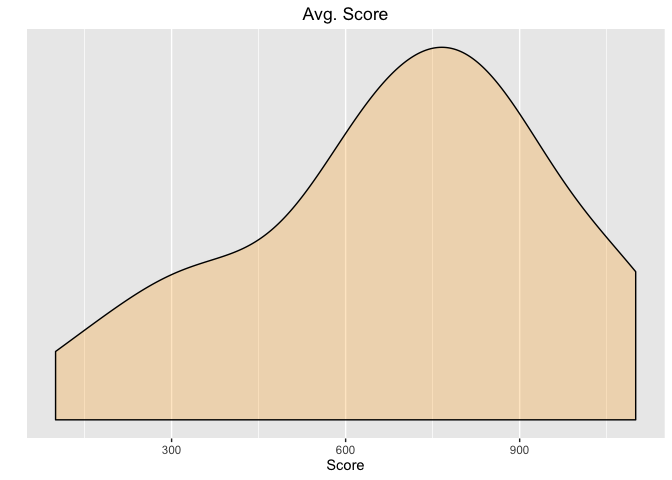
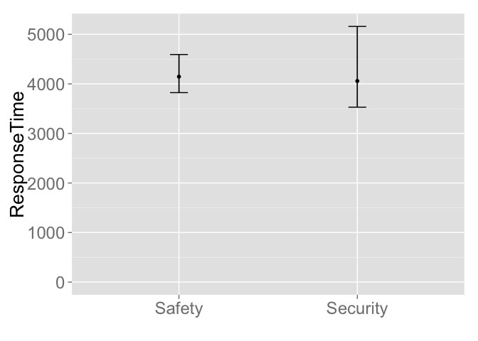

WearCPS: Safety vs. Security Analysis
================

Introduction
------------

Below is the initial analyis/breakdown of the test data collected through our website **WearCPS.me**.

Average Ages
------------

Average ages of participants:

``` r
summary(Ages$age)
```

    ##    Min. 1st Qu.  Median    Mean 3rd Qu.    Max. 
    ##    20.0    20.0    20.5    21.0    21.0    24.0

``` r
ggplot(Ages, aes(x=age)) +  geom_dotplot(binwidth = .3) +
  scale_y_continuous(name = "", breaks = NULL) + ggtitle("Average Ages") +
  labs(x="Ages",y="Ages") 
```


Avg. Score
----------

Basic plot of Avg. Score:

``` r
summary(SexVsScore)
```

    ##    sex      finalScore  
    ##  Male:6   Min.   :-400  
    ##           1st Qu.: 250  
    ##           Median : 400  
    ##           Mean   : 350  
    ##           3rd Qu.: 625  
    ##           Max.   : 800

``` r
ggplot(SexVsScore, aes(x=finalScore)) +  geom_density(kernel = "gaussian", fill='orange', alpha=0.25) + ggtitle("Avg. Score") + labs(x="Score", y ="Density") +
  scale_y_continuous(name = "", breaks = NULL)
```



Avg. Response Time
------------------

Basic plot of Avg. Response Times:

``` r
summary(NotificationResponseTimes)
```

    ##       avg            secAvg          safAvg    
    ##  Min.   : 2798   Min.   : 2468   Min.   :3459  
    ##  1st Qu.: 3588   1st Qu.: 3488   1st Qu.:3696  
    ##  Median : 4068   Median : 4547   Median :3824  
    ##  Mean   : 4846   Mean   : 5606   Mean   :4265  
    ##  3rd Qu.: 4326   3rd Qu.: 4916   3rd Qu.:4058  
    ##  Max.   :10299   Max.   :13902   Max.   :6696

``` r
x <- data.frame(Average=NotificationResponseTimes$avg,Security=NotificationResponseTimes$secAvg,Safety=NotificationResponseTimes$safAvg)
library(ggplot2);library(reshape2)
data<- melt(x)
```

    ## No id variables; using all as measure variables

``` r
ggplot(data,aes(x=value, fill=variable)) + geom_density(alpha=0.25) + ggtitle("Response Times") + labs(x="Time(ms)", y ="Density") +
  scale_y_continuous(name = "", breaks = NULL)
```


Notification Correctness
------------------------

Basic plot of Notification Correctness:

``` r
summary(NotificationResponseCorrectness)
```

    ##    avgCorrect     secAvgCorrect     safAvgCorrect   
    ##  Min.   :0.0000   Min.   :0.00000   Min.   :0.0000  
    ##  1st Qu.:0.3750   1st Qu.:0.08333   1st Qu.:0.5417  
    ##  Median :0.5000   Median :0.41667   Median :0.6667  
    ##  Mean   :0.4722   Mean   :0.38889   Mean   :0.5639  
    ##  3rd Qu.:0.6250   3rd Qu.:0.50000   3rd Qu.:0.7292  
    ##  Max.   :0.8333   Max.   :1.00000   Max.   :0.8000

``` r
x <- data.frame(Average=NotificationResponseCorrectness$avgCorrect,Security=NotificationResponseCorrectness$secAvgCorrect,Safety=NotificationResponseCorrectness$safAvgCorrect)
library(ggplot2);library(reshape2)
data<- melt(x)
```

    ## No id variables; using all as measure variables

``` r
ggplot(data,aes(x=value, fill=variable)) + geom_density(alpha=0.25) + ggtitle("Notification Correctness") + labs(x="Percent Correct", y ="Density") +
  scale_y_continuous(name = "", breaks = NULL)
```


Recall Correctness
------------------

Basic plot of Recall Correctness:

``` r
summary(RecallCorrectPercentages)
```

    ##    avgPercent       secPercent       safPercent    
    ##  Min.   :0.4000   Min.   :0.0000   Min.   :0.0000  
    ##  1st Qu.:0.5833   1st Qu.:0.6667   1st Qu.:1.0000  
    ##  Median :0.8333   Median :0.7083   Median :1.0000  
    ##  Mean   :0.7611   Mean   :0.6806   Mean   :0.8333  
    ##  3rd Qu.:0.9583   3rd Qu.:0.9375   3rd Qu.:1.0000  
    ##  Max.   :1.0000   Max.   :1.0000   Max.   :1.0000

``` r
x <- data.frame(Average=RecallCorrectPercentages$avgPercent,Security=RecallCorrectPercentages$secPercent,Safety=RecallCorrectPercentages$safPercent)
library(ggplot2);library(reshape2)
data<- melt(x)
```

    ## No id variables; using all as measure variables

``` r
ggplot(data,aes(x=value, fill=variable)) + geom_density(alpha=0.25) + ggtitle("Recall Correctness") + labs(x="Percent Correct", y ="Density") +
  scale_y_continuous(name = "", breaks = NULL)
```


``` r
library(dplyr)
```

    ## 
    ## Attaching package: 'dplyr'

    ## The following objects are masked from 'package:stats':
    ## 
    ##     filter, lag

    ## The following objects are masked from 'package:base':
    ## 
    ##     intersect, setdiff, setequal, union

``` r
library(boot)
library(ggplot2)


# Bootstrap 95% CI for mean
# function to obtain mean from the data (with indexing)
mean.fun <- function(D, d) {
  return( mean(D[d]) )
}

data <- filterResponseTimesPerRow

# CI plot
# Example of usage: ciplot("myDependentVariable","myIndependentVariable") 
ciplot <- function(xVar, yVar) {
  
  groups <- group_by_(data, xVar)
  
  # Note: So far it is the only way found to enable variable name as string parameter for the function
  groupedData <- eval(parse(text=sprintf("summarize(groups, 
                                         mean=mean(%s),
                                         UCI=boot.ci(boot(%s, statistic = mean.fun, R=1000, sim=\"ordinary\"))$bca[,5],
                                         LCI=boot.ci(boot(%s, statistic = mean.fun, R=1000, sim=\"ordinary\"))$bca[,4])",
                                         yVar, yVar, yVar)))
  
  # Note: Another way to compute bootstrap CIs (boot library is used here instead), is to compute it mannually.
  # By adding mutate(se=sd/sqrt(n),lower=resp+qnorm(0.025)*se,upper=resp+qnorm(0.975)*se)
  df <- data.frame(
    trt = factor(groupedData[[1]]),
    resp = groupedData[["mean"]],
    group = factor(groupedData[[1]]),
    upper = c(groupedData[["UCI"]]),
    lower = c(groupedData[["LCI"]])
  )
 
  # Plot CI
  p <- ggplot(df, aes(trt, resp))
  p <- p + theme(axis.title=element_text(size=20), axis.text=element_text(size=18))
  p <- p + geom_pointrange(aes(ymin = lower, ymax = upper)) 
  p <- p + expand_limits(y = 0) 
  p <- p + ylab(yVar) 
  p <- p + xlab("") 
  p <- p + geom_errorbar(aes(ymin = lower, ymax = upper), width = 0.1) 
  #p <- p + coord_flip() #Can flip the coordinate here
  p
}

summary(filterResponseTimesPerRow)
```

    ##        Type     ResponseTime  
    ##  Safety  :19   Min.   : 1367  
    ##  Security:15   1st Qu.: 2961  
    ##                Median : 3598  
    ##                Mean   : 4525  
    ##                3rd Qu.: 5193  
    ##                Max.   :21187

``` r
ciplot("Type", "ResponseTime")
```

    ## Warning in boot.ci(boot(c(6618L, 21187L, 6311L, 4585L, 3870L, 5914L,
    ## 2474L, : bootstrap variances needed for studentized intervals

    ## Warning in boot.ci(boot(c(6618L, 21187L, 6311L, 4585L, 3870L, 5914L,
    ## 2474L, : bootstrap variances needed for studentized intervals

    ## Warning in boot.ci(boot(c(6618L, 21187L, 6311L, 4585L, 3870L, 5914L,
    ## 2474L, : bootstrap variances needed for studentized intervals

    ## Warning in boot.ci(boot(c(6618L, 21187L, 6311L, 4585L, 3870L, 5914L,
    ## 2474L, : bootstrap variances needed for studentized intervals

    ## Warning in boot.ci(boot(c(6618L, 21187L, 6311L, 4585L, 3870L, 5914L,
    ## 2474L, : bootstrap variances needed for studentized intervals

    ## Warning in boot.ci(boot(c(6618L, 21187L, 6311L, 4585L, 3870L, 5914L,
    ## 2474L, : bootstrap variances needed for studentized intervals



``` r
library(bootES)

safety <- subset(filterResponseTimesPerRow, Type=="Safety")
security <- subset(filterResponseTimesPerRow, Type=="Security")

reportES <- function(attr) {
  b <- bootES(data, 
              data.col=attr, 
              group.col="Type", 
              contrast=c(Safety=1,Security=-1), 
              effect.type="cohens.d"
  )
  
  cat( "d=",     round( b$t0, 2), "~", 
       "[", round( b$bounds[1], 2), ",", 
       round( b$bounds[2], 2), "]", 
       sep="")
}

reportES("ResponseTime")
```

    ## d=-0.27~[-0.83,0.53]

**Note** that the `echo = FALSE` parameter can be added to the code chunk to prevent printing of the R code that generates the plot.
