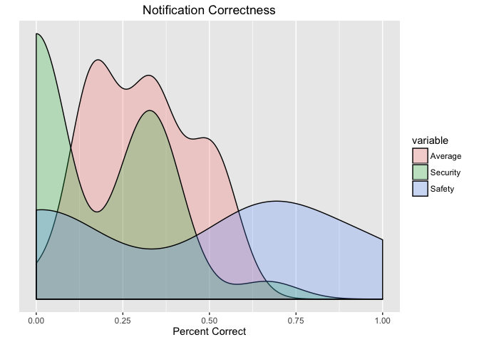
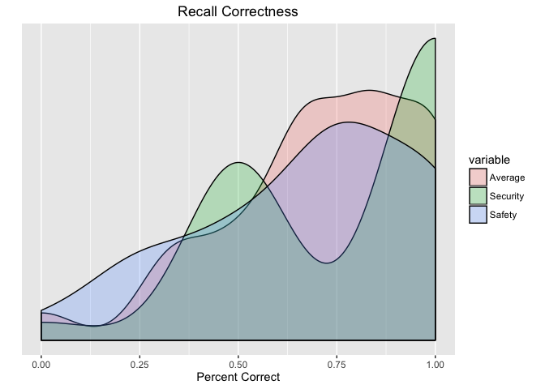
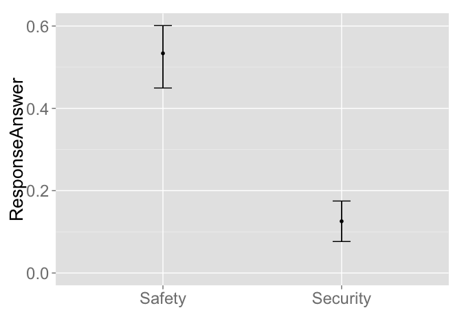

WearCPS: Safety vs. Security Analysis
================

Introduction
------------

Below is the initial analyis/breakdown of the test data collected through our website **WearCPS.me**.

Average Ages
------------

Average ages of participants:

``` r
summary(filterAge$age)
```

    ##    Min. 1st Qu.  Median    Mean 3rd Qu.    Max. 
    ##   22.00   27.00   32.00   33.43   38.00   55.00

``` r
ggplot(filterAge, aes(x=age)) +  geom_dotplot(binwidth = .3) +
  scale_y_continuous(name = "", breaks = NULL) + ggtitle("Average Ages") +
  labs(x="Ages",y="Ages") 
```


Avg. Score
----------

Basic plot of Avg. Score:

``` r
summary(filterScore)
```

    ##      sex       finalScore    
    ##  Female:11   Min.   : 100.0  
    ##  Male  :17   1st Qu.: 575.0  
    ##              Median : 700.0  
    ##              Mean   : 689.3  
    ##              3rd Qu.: 900.0  
    ##              Max.   :1100.0

``` r
ggplot(filterScore, aes(x=finalScore)) +  geom_density(kernel = "gaussian", fill='orange', alpha=0.25) + ggtitle("Avg. Score") + labs(x="Score", y ="Density") +
  scale_y_continuous(name = "", breaks = NULL)
```


Avg. Response Time
------------------

Basic plot of Avg. Response Times:

``` r
summary(filterResponseTimes)
```

    ##       avg           secAvg         safAvg     
    ##  Min.   :1446   Min.   :1521   Min.   : 1371  
    ##  1st Qu.:2865   1st Qu.:2576   1st Qu.: 2632  
    ##  Median :3678   Median :3391   Median : 3951  
    ##  Mean   :4105   Mean   :3815   Mean   : 4399  
    ##  3rd Qu.:4881   3rd Qu.:4326   3rd Qu.: 5569  
    ##  Max.   :7426   Max.   :8151   Max.   :10017  
    ##  NA's   :1      NA's   :1      NA's   :1

``` r
x <- data.frame(Average=filterResponseTimes$avg,Security=filterResponseTimes$secAvg,Safety=filterResponseTimes$safAvg)
library(ggplot2);library(reshape2)
data<- melt(x)
```

    ## No id variables; using all as measure variables

``` r
ggplot(data,aes(x=value, fill=variable)) + geom_density(alpha=0.25) + ggtitle("Response Times") + labs(x="Time(ms)", y ="Density") +
  scale_y_continuous(name = "", breaks = NULL)
```

    ## Warning in loop_apply(n, do.ply): Removed 1 rows containing non-finite
    ## values (stat_density).

    ## Warning in loop_apply(n, do.ply): Removed 1 rows containing non-finite
    ## values (stat_density).

    ## Warning in loop_apply(n, do.ply): Removed 1 rows containing non-finite
    ## values (stat_density).


Notification Correctness
------------------------

Basic plot of Notification Correctness:

``` r
summary(filterNotificationResponseCorrectness)
```

    ##    avgCorrect     secAvgCorrect    safAvgCorrect   
    ##  Min.   :0.0000   Min.   :0.0000   Min.   :0.0000  
    ##  1st Qu.:0.1667   1st Qu.:0.0000   1st Qu.:0.0000  
    ##  Median :0.3333   Median :0.0000   Median :0.6667  
    ##  Mean   :0.3051   Mean   :0.1574   Mean   :0.4568  
    ##  3rd Qu.:0.4167   3rd Qu.:0.3333   3rd Qu.:0.6667  
    ##  Max.   :0.5714   Max.   :0.6667   Max.   :1.0000  
    ##  NA's   :1        NA's   :1        NA's   :1

``` r
x <- data.frame(Average=filterNotificationResponseCorrectness$avgCorrect,Security=filterNotificationResponseCorrectness$secAvgCorrect,Safety=filterNotificationResponseCorrectness$safAvgCorrect)
library(ggplot2);library(reshape2)
data<- melt(x)
```

    ## No id variables; using all as measure variables

``` r
ggplot(data,aes(x=value, fill=variable)) + geom_density(alpha=0.25) + ggtitle("Notification Correctness") + labs(x="Percent Correct", y ="Density") +
  scale_y_continuous(name = "", breaks = NULL)
```

    ## Warning in loop_apply(n, do.ply): Removed 1 rows containing non-finite
    ## values (stat_density).

    ## Warning in loop_apply(n, do.ply): Removed 1 rows containing non-finite
    ## values (stat_density).

    ## Warning in loop_apply(n, do.ply): Removed 1 rows containing non-finite
    ## values (stat_density).



Recall Correctness
------------------

Basic plot of Recall Correctness:

``` r
summary(filterRecallCorrectness)
```

    ##    avgPercent       secPercent       safPercent    
    ##  Min.   :0.0000   Min.   :0.0000   Min.   :0.0000  
    ##  1st Qu.:0.6250   1st Qu.:0.5000   1st Qu.:0.5000  
    ##  Median :0.7500   Median :1.0000   Median :0.7500  
    ##  Mean   :0.7143   Mean   :0.7857   Mean   :0.6786  
    ##  3rd Qu.:0.8750   3rd Qu.:1.0000   3rd Qu.:1.0000  
    ##  Max.   :1.0000   Max.   :1.0000   Max.   :1.0000

``` r
x <- data.frame(Average=filterRecallCorrectness$avgPercent,Security=filterRecallCorrectness$secPercent,Safety=filterRecallCorrectness$safPercent)
library(ggplot2);library(reshape2)
data<- melt(x)
```

    ## No id variables; using all as measure variables

``` r
ggplot(data,aes(x=value, fill=variable)) + geom_density(alpha=0.25) + ggtitle("Recall Correctness") + labs(x="Percent Correct", y ="Density") +
  scale_y_continuous(name = "", breaks = NULL)
```



``` r
library(dplyr)
```

    ## 
    ## Attaching package: 'dplyr'

    ## The following object is masked from 'package:stats':
    ## 
    ##     filter

    ## The following objects are masked from 'package:base':
    ## 
    ##     intersect, setdiff, setequal, union

``` r
library(boot)
```

    ## Warning: package 'boot' was built under R version 3.1.3

``` r
library(ggplot2)


# Bootstrap 95% CI for mean
# function to obtain mean from the data (with indexing)
mean.fun <- function(D, d) {
  return( mean(D[d]) )
}

data <- filterResponseTimesPerRow

# CI plot
# Example of usage: ciplot("myDependentVariable","myIndependentVariable") 
ciplot <- function(xVar, yVar) {
  
  groups <- group_by_(data, xVar)
  
  # Note: So far it is the only way found to enable variable name as string parameter for the function
  groupedData <- eval(parse(text=sprintf("summarize(groups, 
                                         mean=mean(%s),
                                         UCI=boot.ci(boot(%s, statistic = mean.fun, R=1000, sim=\"ordinary\"))$bca[,5],
                                         LCI=boot.ci(boot(%s, statistic = mean.fun, R=1000, sim=\"ordinary\"))$bca[,4])",
                                         yVar, yVar, yVar)))
  
  # Note: Another way to compute bootstrap CIs (boot library is used here instead), is to compute it mannually.
  # By adding mutate(se=sd/sqrt(n),lower=resp+qnorm(0.025)*se,upper=resp+qnorm(0.975)*se)
  df <- data.frame(
    trt = factor(groupedData[[1]]),
    resp = groupedData[["mean"]],
    group = factor(groupedData[[1]]),
    upper = c(groupedData[["UCI"]]),
    lower = c(groupedData[["LCI"]])
  )
 
  # Plot CI
  p <- ggplot(df, aes(trt, resp))
  p <- p + theme(axis.title=element_text(size=20), axis.text=element_text(size=18))
  p <- p + geom_pointrange(aes(ymin = lower, ymax = upper)) 
  p <- p + expand_limits(y = 0) 
  p <- p + ylab(yVar) 
  p <- p + xlab("") 
  p <- p + geom_errorbar(aes(ymin = lower, ymax = upper), width = 0.1) 
  #p <- p + coord_flip() #Can flip the coordinate here
  p
}

summary(filterResponseTimesPerRow)
```

    ##        Type     ResponseTime  
    ##  Safety  :81   Min.   : 1034  
    ##  Security:82   1st Qu.: 2342  
    ##                Median : 3484  
    ##                Mean   : 4097  
    ##                3rd Qu.: 5312  
    ##                Max.   :14956

``` r
ciplot("Type", "ResponseTime")
```

    ## Warning in boot.ci(boot(c(2603L, 2538L, 3675L, 4087L, 4040L, 8364L,
    ## 5286L, : bootstrap variances needed for studentized intervals

    ## Warning in boot.ci(boot(c(2603L, 2538L, 3675L, 4087L, 4040L, 8364L,
    ## 5286L, : bootstrap variances needed for studentized intervals

    ## Warning in boot.ci(boot(c(2603L, 2538L, 3675L, 4087L, 4040L, 8364L,
    ## 5286L, : bootstrap variances needed for studentized intervals

    ## Warning in boot.ci(boot(c(2603L, 2538L, 3675L, 4087L, 4040L, 8364L,
    ## 5286L, : bootstrap variances needed for studentized intervals


Confidence Interval Correctness
-------------------------------

Basic plot of Notification Correctness:

``` r
library(dplyr)
library(boot)
library(ggplot2)


# Bootstrap 95% CI for mean
# function to obtain mean from the data (with indexing)
mean.fun <- function(D, d) {
  return( mean(D[d]) )
}

data2 <- filterNotificationResponseCorrectnessPerRow

# CI plot
# Example of usage: ciplot("myDependentVariable","myIndependentVariable") 
ciplot2 <- function(xVar, yVar) {
  
  groups <- group_by_(data2, xVar)
  
  # Note: So far it is the only way found to enable variable name as string parameter for the function
  groupedData <- eval(parse(text=sprintf("summarize(groups, 
                                         mean=mean(%s),
                                         UCI=boot.ci(boot(%s, statistic = mean.fun, R=1000, sim=\"ordinary\"))$bca[,5],
                                         LCI=boot.ci(boot(%s, statistic = mean.fun, R=1000, sim=\"ordinary\"))$bca[,4])",
                                         yVar, yVar, yVar)))
  
  # Note: Another way to compute bootstrap CIs (boot library is used here instead), is to compute it mannually.
  # By adding mutate(se=sd/sqrt(n),lower=resp+qnorm(0.025)*se,upper=resp+qnorm(0.975)*se)
  df2 <- data.frame(
    trt = factor(groupedData[[1]]),
    resp = groupedData[["mean"]],
    group = factor(groupedData[[1]]),
    upper = c(groupedData[["UCI"]]),
    lower = c(groupedData[["LCI"]])
  )
 
  # Plot CI
  p2 <- ggplot(df2, aes(trt, resp))
  p2 <- p2 + theme(axis.title=element_text(size=20), axis.text=element_text(size=18))
  p2 <- p2 + geom_pointrange(aes(ymin = lower, ymax = upper)) 
  p2 <- p2 + expand_limits(y = 0) 
  p2 <- p2 + ylab(yVar) 
  p2 <- p2 + xlab("") 
  p2 <- p2 + geom_errorbar(aes(ymin = lower, ymax = upper), width = 0.1) 
  #p <- p + coord_flip() #Can flip the coordinate here
  p2
}

summary(filterNotificationResponseCorrectnessPerRow)
```

    ##        Type    ResponseAnswer  
    ##  Safety  :81   Min.   :0.0000  
    ##  Security:82   1st Qu.:0.0000  
    ##                Median :0.0000  
    ##                Mean   :0.3067  
    ##                3rd Qu.:1.0000  
    ##                Max.   :1.0000

``` r
ciplot2("Type", "ResponseAnswer")
```

    ## Warning in boot.ci(boot(c(0L, 0L, 0L, 0L, 0L, 0L, 0L, 1L, 0L, 0L, 0L, 1L, :
    ## bootstrap variances needed for studentized intervals

    ## Warning in boot.ci(boot(c(0L, 0L, 0L, 0L, 0L, 0L, 0L, 1L, 0L, 0L, 0L, 1L, :
    ## bootstrap variances needed for studentized intervals

    ## Warning in boot.ci(boot(c(0L, 0L, 0L, 0L, 0L, 0L, 0L, 1L, 0L, 0L, 0L, 1L, :
    ## bootstrap variances needed for studentized intervals

    ## Warning in boot.ci(boot(c(0L, 0L, 0L, 0L, 0L, 0L, 0L, 1L, 0L, 0L, 0L, 1L, :
    ## bootstrap variances needed for studentized intervals



``` r
library(bootES)

reportES <- function(attr) {
  b <- bootES(data, 
              data.col=attr, 
              group.col="Type", 
              contrast=c(Safety=1,Security=-1), 
              effect.type="cohens.d"
  )
  
  cat( "d=",     round( b$t0, 2), "~", 
       "[", round( b$bounds[1], 2), ",", 
       round( b$bounds[2], 2), "]", 
       sep="")
}

reportES("ResponseTime")
```

    ## d=0.25~[-0.06,0.52]

### Power Analysis

``` r
# Example (breaking down the functions)
# Effect Size is the key. 
# While we have good estimates of variability from a given metric (like visited),
# the means of group 1 and 2 are something we should reason about.
# It's helpful to plug different means in (hypothetical means) to see how suggested "n" changes.
#
# Effect size is defined as:
# effectsize = abs(meangroup1 - meangroup2) / stdevofbothgroups
# abs( mean( fade$visited ) - mean( nofade$visited ) ) / sd( data$visited ), 
# We assume a power of 0.8 (a good estimate according to wikipedia)
# Then we plug those into the pwr.t.test function like:
# 
# desired <- pwr.t.test( 
#   d=effectsize # from above 
#   sig.level=.05, 
#   power=0.8, 
#   type="two.sample"  # changes if we do paired tests, or one sided
# )
# `desired` contains information about power, n, etcetera. We want `desired$n`
# A heuristic if your actual data are non-normal (given we are using tests for normal data) is to add 15% to n.
# Also, `desired$n` is initially the number in *each* group, so we need to multiply by 2
# desired$n * 1.15 * 2 # participants needed for a "safe" experiment given the means and stdev
#shinyApp(
#  
#  ui = fluidPage(
#    #  Application title
#    titlePanel("Interactive Power Analysis for Visited"),
#    
#    # Sidebar with sliders that demonstrate various available
#    # options
#    sidebarLayout(
#      sidebarPanel(
#        # Simple integer interval
#        sliderInput("group1", "Group1:", 
#                    min=0, max=50, value=mean(fade$visited)),
#        
#        sliderInput("group2", "Group2:", 
#                    min=0, max=50, value=mean(nofade$visited))
#      ),
#      
#      # Show a table summarizing the values entered
#      mainPanel(
#        tableOutput("values")
#      )
#  )),
#  
#  server = function(input, output) {
#    # Reactive expression to compose a data frame containing all of
#    # the values
#    sliderValues <- reactive({
#      
#      numParticipants <- pwr.t.test( 
#        d=abs(   mean(   input$group1 ) - 
#                 mean(   input$group2 ) ) / 
#                 14.28, 
#        sig.level=.05, 
#        power=0.8, 
#        type="two.sample" 
#      )$n * 1.15 * 2
#      
#      # Compose data frame
#      data.frame(
#        Name = c("group1", 
#                 "group2",
#                 "necessaryN"),
#        Value = as.character(c(input$group1, 
#                               input$group2,
#                               numParticipants)), 
#        stringsAsFactors=FALSE)
#    }) 
#    
#    # Show the values using an HTML table
#    output$values <- renderTable({
#      sliderValues()
#    })
#  },
#  
#  options = list(height = 500)
#)

library(pwr)

safety <- subset(filterResponseTimesPerRow, Type=="Safety")
security <- subset(filterResponseTimesPerRow, Type=="Security")

# our current difference
pwr.t.test( 
  d=abs( mean(   safety$ResponseTime ) - 
         mean( security$ResponseTime ) ) / 
         sd(     filterResponseTimesPerRow$ResponseTime ), 
  sig.level=.05, 
  power=0.8, 
  type="two.sample" 
)$n * 1.15 * 2
```

    ## [1] 602.6842

``` r
# assuming a 2.5 second reliable difference
pwr.t.test( 
  d=abs( 2500 ) / 
         sd(     filterResponseTimesPerRow$ResponseTime ), 
  sig.level=.05, 
  power=0.8, 
  type="two.sample" 
)$n * 1.15 * 2
```

    ## [1] 37.07659

**Note** that the `echo = FALSE` parameter can be added to the code chunk to prevent printing of the R code that generates the plot.
