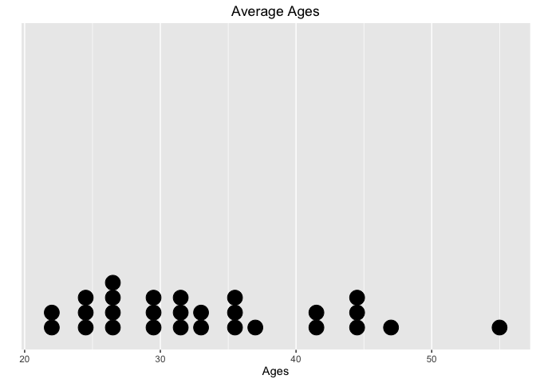

WearCPS: Safety vs. Security Analysis
================

Introduction
------------

Below is the initial analyis/breakdown of the test data collected through our website **WearCPS.me**.

Average Ages
------------

Average ages of participants:

``` r
summary(Ages$age)
```

    ##    Min. 1st Qu.  Median    Mean 3rd Qu.    Max. 
    ##       9       9       9      11      12      15

``` r
ggplot(Ages, aes(x=age)) +  geom_dotplot(binwidth = .3) +
  scale_y_continuous(name = "", breaks = NULL) + ggtitle("Average Ages") +
  labs(x="Ages",y="Ages") 
```



Avg. Score
----------

Basic plot of Avg. Score:

``` r
summary(SexVsScore)
```

    ##    sex      finalScore   
    ##  Male:3   Min.   :-5900  
    ##           1st Qu.:-2550  
    ##           Median :  800  
    ##           Mean   :-1433  
    ##           3rd Qu.:  800  
    ##           Max.   :  800

``` r
ggplot(SexVsScore, aes(x=finalScore)) +  geom_density(kernel = "gaussian", fill='orange') + ggtitle("Avg. Score") + labs(x="Score", y ="Density") 
```


Avg. Response Time
------------------

Basic plot of Avg. Response Times:

``` r
summary(NotificationResponseTimes)
```

    ##       avg           secAvg         safAvg    
    ##  Min.   :3394   Min.   :2699   Min.   :3912  
    ##  1st Qu.:4007   1st Qu.:3535   1st Qu.:5282  
    ##  Median :4619   Median :4371   Median :6652  
    ##  Mean   :4898   Mean   :4759   Mean   :6632  
    ##  3rd Qu.:5650   3rd Qu.:5790   3rd Qu.:7993  
    ##  Max.   :6680   Max.   :7208   Max.   :9334

``` r
x <- data.frame(v1=NotificationResponseTimes$avg,v2=NotificationResponseTimes$secAvg,v3=NotificationResponseTimes$safAvg)
library(ggplot2);library(reshape2)
data<- melt(x)
```

    ## No id variables; using all as measure variables

``` r
ggplot(data,aes(x=value, fill=variable)) + geom_density(alpha=0.25) + ggtitle("Response Times") + labs(x="Time(ms)", y ="Density")
```


Recall Correctness
------------------

Basic plot of Recall Correctness:

``` r
summary(RecallCorrectPercentages)
```

    ##    avgPercent       secPercent       safPercent    
    ##  Min.   :0.1667   Min.   :0.0000   Min.   :0.2000  
    ##  1st Qu.:0.3333   1st Qu.:0.2500   1st Qu.:0.2667  
    ##  Median :0.5000   Median :0.5000   Median :0.3333  
    ##  Mean   :0.3889   Mean   :0.3889   Mean   :0.3444  
    ##  3rd Qu.:0.5000   3rd Qu.:0.5833   3rd Qu.:0.4167  
    ##  Max.   :0.5000   Max.   :0.6667   Max.   :0.5000

**Note** that the `echo = FALSE` parameter can be added to the code chunk to prevent printing of the R code that generates the plot.
