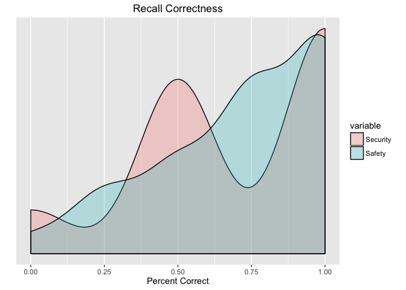
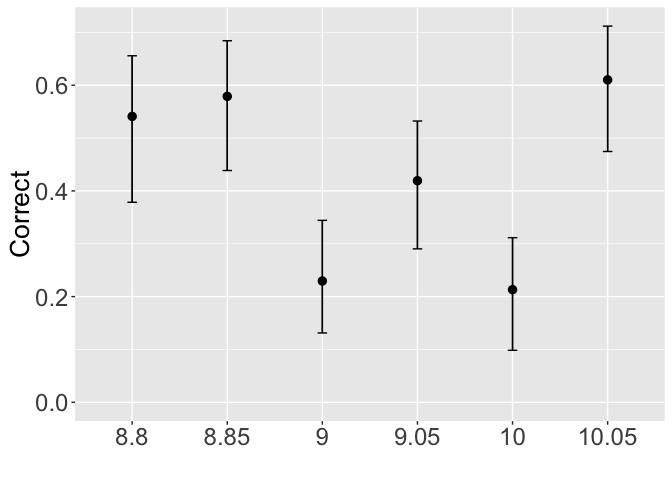

WearCPS: Safety vs. Security Analysis
================

Introduction
------------

Below is the initial analyis/breakdown of the test data collected through our online pilot, **WearCPS.me**, through Amazon's Mechanical Turk

Average Ages
------------

Average ages of participants:

    ##    Min. 1st Qu.  Median    Mean 3rd Qu.    Max. 
    ##   13.00   26.00   30.00   31.79   34.00   55.00

    ## `stat_bindot()` using `bins = 30`. Pick better value with `binwidth`.

Score/Performance vs. Education Breakdown
-----------------------------------------

    ##  EducationLevel     NotificationCorrect   FinalScore    
    ##  Length:61          Min.   :0.000       Min.   :-800.0  
    ##  Class :character   1st Qu.:1.000       1st Qu.: 400.0  
    ##  Mode  :character   Median :3.000       Median : 700.0  
    ##                     Mean   :2.541       Mean   : 680.3  
    ##                     3rd Qu.:4.000       3rd Qu.: 900.0  
    ##                     Max.   :6.000       Max.   :3700.0

Avg. Score
----------

PDF of Avg. Score:

    ##      sex              finalScore    
    ##  Length:61          Min.   :-800.0  
    ##  Class :character   1st Qu.: 400.0  
    ##  Mode  :character   Median : 700.0  
    ##                     Mean   : 680.3  
    ##                     3rd Qu.: 900.0  
    ##                     Max.   :3700.0

Avg. Response Time
------------------

PDF of Avg. Response Times:

    ##       avg            secAvg          safAvg     
    ##  Min.   : 1600   Min.   : 1516   Min.   : 1325  
    ##  1st Qu.: 2847   1st Qu.: 2634   1st Qu.: 2505  
    ##  Median : 3656   Median : 3470   Median : 3824  
    ##  Mean   : 4194   Mean   : 4058   Mean   : 4166  
    ##  3rd Qu.: 4858   3rd Qu.: 4514   3rd Qu.: 5150  
    ##  Max.   :14902   Max.   :19159   Max.   :10936

    ## No id variables; using all as measure variables

Notification Correctness
------------------------

PDF of Avg. Notification Correctness:

    ##    avgCorrect     secAvgCorrect    safAvgCorrect   
    ##  Min.   :0.0000   Min.   :0.0000   Min.   :0.0000  
    ##  1st Qu.:0.1667   1st Qu.:0.0000   1st Qu.:0.3333  
    ##  Median :0.5000   Median :0.3333   Median :0.3333  
    ##  Mean   :0.4262   Mean   :0.3279   Mean   :0.5273  
    ##  3rd Qu.:0.6667   3rd Qu.:0.6667   3rd Qu.:1.0000  
    ##  Max.   :1.0000   Max.   :1.0000   Max.   :1.0000

    ## No id variables; using all as measure variables

Recall Correctness
------------------

PDF of Avg. Recall Correctness:

    ##    avgPercent       secPercent       safPercent    
    ##  Min.   :0.0000   Min.   :0.0000   Min.   :0.0000  
    ##  1st Qu.:0.5000   1st Qu.:0.5000   1st Qu.:0.5000  
    ##  Median :0.8333   Median :1.0000   Median :0.7500  
    ##  Mean   :0.7186   Mean   :0.7049   Mean   :0.7254  
    ##  3rd Qu.:0.8333   3rd Qu.:1.0000   3rd Qu.:1.0000  
    ##  Max.   :1.0000   Max.   :1.0000   Max.   :1.0000

    ## No id variables; using all as measure variables

Confidence Intervals
--------------------

### Response Times

Confidence intervals of the response times of safety vs. security.

    ## Warning in boot.ci(boot(c(1823L, 1182L, 3432L, 5581L, 2204L, 3457L,
    ## 5295L, : bootstrap variances needed for studentized intervals

    ## Warning in boot.ci(boot(c(1823L, 1182L, 3432L, 5581L, 2204L, 3457L,
    ## 5295L, : bootstrap variances needed for studentized intervals

    ## Warning in boot.ci(boot(c(1823L, 1182L, 3432L, 5581L, 2204L, 3457L,
    ## 5295L, : bootstrap variances needed for studentized intervals

    ## Warning in boot.ci(boot(c(1823L, 1182L, 3432L, 5581L, 2204L, 3457L,
    ## 5295L, : bootstrap variances needed for studentized intervals

    ## Warning in boot.ci(boot(c(1823L, 1182L, 3432L, 5581L, 2204L, 3457L,
    ## 5295L, : bootstrap variances needed for studentized intervals

    ## Warning in boot.ci(boot(c(1823L, 1182L, 3432L, 5581L, 2204L, 3457L,
    ## 5295L, : bootstrap variances needed for studentized intervals

    ##      Type            ResponseTime  
    ##  Length:361         Min.   : 1091  
    ##  Class :character   1st Qu.: 2142  
    ##  Mode  :character   Median : 3418  
    ##                     Mean   : 4101  
    ##                     3rd Qu.: 4887  
    ##                     Max.   :53430

### Response Correctness

Confidence intervals of the response correctness of safety vs. security.

    ## Warning in boot.ci(boot(c(0L, 0L, 0L, 0L, 0L, 0L, 0L, 0L, 1L, 0L, 0L, 0L, :
    ## bootstrap variances needed for studentized intervals

    ## Warning in boot.ci(boot(c(0L, 0L, 0L, 0L, 0L, 0L, 0L, 0L, 1L, 0L, 0L, 0L, :
    ## bootstrap variances needed for studentized intervals

    ## Warning in boot.ci(boot(c(0L, 0L, 0L, 0L, 0L, 0L, 0L, 0L, 1L, 0L, 0L, 0L, :
    ## bootstrap variances needed for studentized intervals

    ## Warning in boot.ci(boot(c(0L, 0L, 0L, 0L, 0L, 0L, 0L, 0L, 1L, 0L, 0L, 0L, :
    ## bootstrap variances needed for studentized intervals

    ## Warning in boot.ci(boot(c(0L, 0L, 0L, 0L, 0L, 0L, 0L, 0L, 1L, 0L, 0L, 0L, :
    ## bootstrap variances needed for studentized intervals

    ## Warning in boot.ci(boot(c(0L, 0L, 0L, 0L, 0L, 0L, 0L, 0L, 1L, 0L, 0L, 0L, :
    ## bootstrap variances needed for studentized intervals

    ##      Type           ResponseAnswer  
    ##  Length:361         Min.   :0.0000  
    ##  Class :character   1st Qu.:0.0000  
    ##  Mode  :character   Median :0.0000  
    ##                     Mean   :0.4294  
    ##                     3rd Qu.:1.0000  
    ##                     Max.   :1.0000

### Recall Correctness

Confidence intervals of the recall correctness of safety vs. security.

    ## Warning in boot.ci(boot(c(1L, 0L, 1L, 0L, 1L, 1L, 1L, 1L, 0L, 1L, 0L, 1L, :
    ## bootstrap variances needed for studentized intervals

    ## Warning in boot.ci(boot(c(1L, 0L, 1L, 0L, 1L, 1L, 1L, 1L, 0L, 1L, 0L, 1L, :
    ## bootstrap variances needed for studentized intervals

    ## Warning in boot.ci(boot(c(1L, 0L, 1L, 0L, 1L, 1L, 1L, 1L, 0L, 1L, 0L, 1L, :
    ## bootstrap variances needed for studentized intervals

    ## Warning in boot.ci(boot(c(1L, 0L, 1L, 0L, 1L, 1L, 1L, 1L, 0L, 1L, 0L, 1L, :
    ## bootstrap variances needed for studentized intervals

    ## Warning in boot.ci(boot(c(1L, 0L, 1L, 0L, 1L, 1L, 1L, 1L, 0L, 1L, 0L, 1L, :
    ## bootstrap variances needed for studentized intervals

    ## Warning in boot.ci(boot(c(1L, 0L, 1L, 0L, 1L, 1L, 1L, 1L, 0L, 1L, 0L, 1L, :
    ## bootstrap variances needed for studentized intervals

    ##      Type               Answer      
    ##  Length:366         Min.   :0.0000  
    ##  Class :character   1st Qu.:0.0000  
    ##  Mode  :character   Median :1.0000  
    ##                     Mean   :0.7186  
    ##                     3rd Qu.:1.0000  
    ##                     Max.   :1.0000

Primary Task Score Over Time
----------------------------

    ##  ParticipantID      PrimaryTaskEntryTime     Score        
    ##  Length:755         Min.   : 37.52       Min.   :-1000.0  
    ##  Class :character   1st Qu.:140.06       1st Qu.:  100.0  
    ##  Mode  :character   Median :190.62       Median :  300.0  
    ##                     Mean   :205.30       Mean   :  429.5  
    ##                     3rd Qu.:250.89       3rd Qu.:  600.0  
    ##                     Max.   :519.50       Max.   : 3700.0

Individual Trial For User A4J4GGMKJ68L0
---------------------------------------

    ##  ParticipantID      PrimaryTaskEntryTime     Score        
    ##  Length:755         Min.   : 37.52       Min.   :-1000.0  
    ##  Class :character   1st Qu.:140.06       1st Qu.:  100.0  
    ##  Mode  :character   Median :190.62       Median :  300.0  
    ##                     Mean   :205.30       Mean   :  429.5  
    ##                     3rd Qu.:250.89       3rd Qu.:  600.0  
    ##                     Max.   :519.50       Max.   : 3700.0

Individual Trial For User A1HWTTN3JEUNZY
----------------------------------------

    ##  ParticipantID      PrimaryTaskEntryTime     Score        
    ##  Length:755         Min.   : 37.52       Min.   :-1000.0  
    ##  Class :character   1st Qu.:140.06       1st Qu.:  100.0  
    ##  Mode  :character   Median :190.62       Median :  300.0  
    ##                     Mean   :205.30       Mean   :  429.5  
    ##                     3rd Qu.:250.89       3rd Qu.:  600.0  
    ##                     Max.   :519.50       Max.   : 3700.0

Notification Grade Level Versus Response Correctness
----------------------------------------------------

Basic plot of response correctness against the reading grade level of the notification.

    ##      Type             GradeLevel        Correct      
    ##  Length:361         Min.   : 8.800   Min.   :0.0000  
    ##  Class :character   1st Qu.: 8.800   1st Qu.:0.0000  
    ##  Mode  :character   Median : 9.000   Median :0.0000  
    ##                     Mean   : 9.267   Mean   :0.4294  
    ##                     3rd Qu.:10.000   3rd Qu.:1.0000  
    ##                     Max.   :10.000   Max.   :1.0000

Wilcox Paired Test
------------------

    ##  secAvgCorrect    safAvgCorrect   
    ##  Min.   :0.0000   Min.   :0.0000  
    ##  1st Qu.:0.0000   1st Qu.:0.3333  
    ##  Median :0.3333   Median :0.3333  
    ##  Mean   :0.3279   Mean   :0.5191  
    ##  3rd Qu.:0.6667   3rd Qu.:1.0000  
    ##  Max.   :1.0000   Max.   :1.0000

    ## 
    ##  Exact Wilcoxon signed rank test
    ## 
    ## data:  filterIDAndCorrectness$secAvgCorrect and filterIDAndCorrectness$safAvgCorrect
    ## V = 94.5, p-value = 2.965e-05
    ## alternative hypothesis: true mu is not equal to 0

Wilcox Unpaired Test
--------------------

    ##  secAvgCorrect    safAvgCorrect   
    ##  Min.   :0.0000   Min.   :0.0000  
    ##  1st Qu.:0.0000   1st Qu.:0.3333  
    ##  Median :0.3333   Median :0.3333  
    ##  Mean   :0.3279   Mean   :0.5191  
    ##  3rd Qu.:0.6667   3rd Qu.:1.0000  
    ##  Max.   :1.0000   Max.   :1.0000

    ## 
    ##  Asymptotic Wilcoxon rank sum test
    ## 
    ## data:  filterIDAndCorrectness$secAvgCorrect and filterIDAndCorrectness$safAvgCorrect
    ## W = 1351.5, p-value = 0.006844
    ## alternative hypothesis: true mu is not equal to 0

Power Analysis
--------------

### Response Time

This is the power analyis for the difference in response time between safety and security notifications. The first number is the power analysis of our results from the pilot. The second number represent the analysis we'd need to show a significant (2.5 seconds) difference in response times.

    ## [1] 79492.61

    ## [1] 100.5687

### Response Correctness

This is the power analyis for the difference in response correctness between safety and security notifications. The first number is the power analysis of our results from the pilot. The second number represent the analysis we'd need to show a significant (20%) difference in response correctness.

    ## [1] 2214.326

    ## [1] 223.9957

**Note** that the `echo = FALSE` parameter can be added to the code chunk to prevent printing of the R code that generates the plot.
